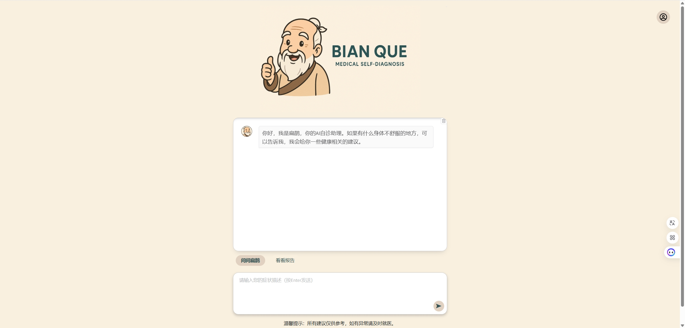

# Bian Que AI: Intelligent Medical Self-Diagnosis & Report Analysis Agent

[中文版文档](./README_CN.md)  


**Bian Que AI** is an open-source AI-powered platform for medical self-diagnosis and report interpretation. Built on top of large language models (LLMs), vector-based knowledge retrieval, and advanced agent architecture (LangGraph), it empowers users with intelligent, accessible, and explainable medical insights.



---

## 🌟 Features

- 🧠 **Dual Intelligent Agents**  
  - **Diagnosis Agent**: Conversational symptom checker with memory support.  
  - **Report Agent**: Parses and interprets uploaded medical reports using OCR and structured reasoning.

- 🔄 **RAG-based Knowledge Retrieval**  
  Uses a Milvus vector database to support Retrieval-Augmented Generation (RAG) for more accurate and context-aware responses.

- 🧾 **OCR Integration**  
  Extracts text from scanned or photographed medical documents for further analysis.

- 🔌 **Unified LLM Interface**  
  Seamlessly switch between Qwen, DeepSeek, or other backends via `get_llm()` API.

---

## 🧬 Project Architecture

```
project/
├── core/
│   ├── agent_build.py         # Agent logic for report and diagnosis.
│   ├── basic_class.py         # Core classes, memory modules, Pydantic models.
│   ├── prompt.py              # Centralized prompt templates.
│   ├── tools.py               # Custom tools for document/query handling.
│   └── llm_calling.py         # Unified LLM invocation and embedding.
├── front/
│   └── web_ui.py              # Gradio-based frontend UI.
├── logger.py                  # Centralized logging system.
├── test/                      # Test cases (to be expanded).
├── Dockerfile                 # Container setup.
├── .env                       # Environment configuration.
└── start.py                   # Entry point for launching the service.
```

---

## ⚙️ Installation

```bash
git clone https://github.com/ShanHaiAI/bianque.git
cd bianque

# Optional: create and activate virtual environment
python -m venv venv
source venv/bin/activate  # Windows: venv\Scripts\activate

# Install dependencies
pip install --no-cache-dir -r requirements.txt
```

---

## 🚀 Usage

### ▶️ Start the Service

```bash
python start.py
```

This script loads environment variables from `.env` and launches the Gradio interface.

### 🌐 Web Interface Tabs

- **🩺 Online Diagnosis** – Chat-based self-diagnosis assistant.
- **📄 Report Analysis** – Upload and analyze medical reports with AI.
- **📚 Knowledge Base Builder** *(hidden)* – Upload documents to enhance the system's knowledge.

---

## 🔧 Configuration

Set environment variables in `.env` like so:

```ini
# LLM API Key
DASHSCOPE_API_KEY=your_qwen_api_key

# Logging
LOG_LEVEL=INFO
```

---

## 🤝 Contributing

We welcome contributions from the community!

1. Fork the repository
2. Create your feature branch (`git checkout -b feature/your-feature`)
3. Commit your changes
4. Push to your branch (`git push origin feature/your-feature`)
5. Open a Pull Request (PR)

---

## 📄 License

Distributed under the [MIT License](./LICENSE).

---

💡 *Bian Que* (扁鹊) is named after one of the earliest legendary physicians in Chinese history, symbolizing diagnostic wisdom and medical intuition. We aim to bring this spirit into the age of AI.
